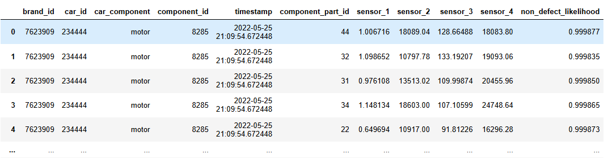

# TimeSeriesOutlierDetection

### Data
The raw data consists of 21 time series as separate csv files. Each time series
looks like this:

### Models

#### HBOSagg
Histogram-Based Outlier Score Aggregator (HBOSAgg) takes the mean of the 
outlier scores of a datapoint from multiple HBOS instances using different bin counts. 
HBOSAgg implements an adapted version of pyod's HBOS class, enabling the 
use of dynamic bins. See HBOS_dynamic_bins in HBOSagg file for more information.

#### MedianLevelShift
Detects level shifts in univariate data using the median of a sliding window.
Predictions are the median of the immediate previous window before a time point.
Estimations are the median of the immediate following windows after a time point.
The size of the level shift is calculated by taking the different between the 
prediction and the estimation. This difference is that given relative to the Median
Absolute Deviation (MAD) of the univariate time series. The relative size of the level
shift can be considered a measure of outlierness of a particular subsequence in the time series.
This cam be compared to the sizes of relative level shifts in other time series from 
identical or similar systems or processes, which will enable an outlier score for the entire
time series. 

#### base
Base class for detectors that compare predictions and estimations based on sliding windows e.g.
MedianLevelShift.

### Testing
Run run_test.py to run tests found in the test-folder.